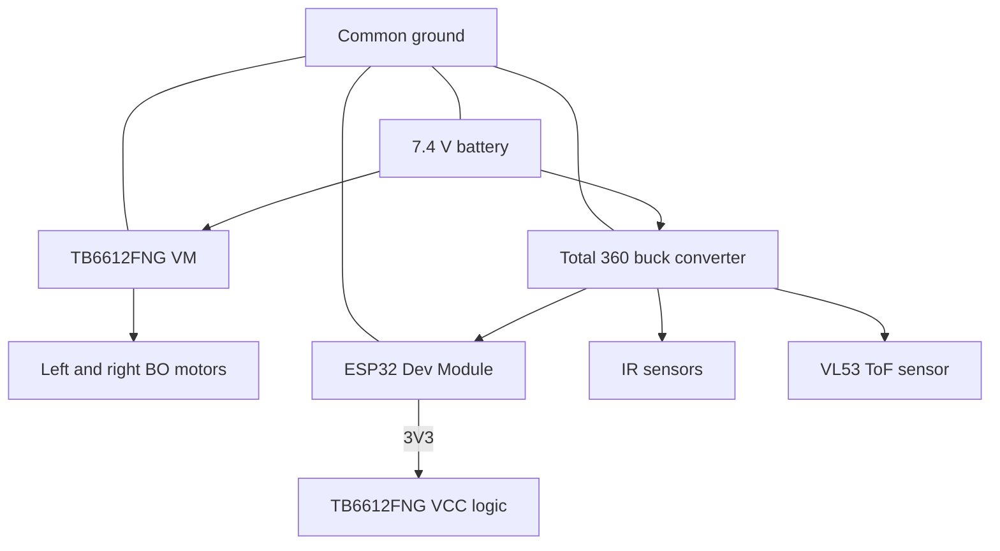

# Power architecture

## Diagram

```
                    7.4 V battery
                          |
          +---------------+----------------+
          |                                |
          v                                v
   TB6612FNG VM                  "Total 360" buck converter
   (motor supply)                (regulated low-voltage output)
          |                                |
          v                  +-------------+-------------+
   left + right BO motors    |             |             |
   (via AO1/AO2, BO1/BO2)    v             v             v
                           ESP32       IR sensors     VL53 ToF
                             |
                             +-- 3V3 --> TB6612FNG VCC (logic)

   COMMON GROUND: battery -, buck GND, TB6612FNG GND, ESP32 GND, IR sensors, ToF
```



## Design

- The motor supply (`VM`) comes from the battery side, so motor current does not flow
  through the regulator.
- The ESP32 and the sensors run from the regulated output of the "Total 360" buck converter,
  which keeps the logic supply stable when the motors draw current.
- The ESP32's 3.3 V output powers the TB6612FNG's logic pin (`VCC`).
- All grounds are common: signals are referenced to ground, and without a common ground the
  PWM and direction signals do not work.

## What is not specified

The project information does not state the buck converter's output voltage or current limit,
the battery capacity, or the motor ratings. Do not assume them.

- **USER MUST VERIFY** the buck converter's output voltage with a multimeter, with the ESP32
  disconnected, and set it to what your ESP32 dev board's supply input accepts (check your board's documentation).
- **USER MUST VERIFY** that the buck's current rating covers the ESP32, the sensors and the ToF.
- **USER MUST VERIFY** the BO motors' rated voltage at 7.4 V, and the TB6612FNG's current limit for your motors.
- **USER MUST VERIFY** the IR modules' and ToF breakout's supply range and logic levels. ESP32 GPIOs
  are not 5 V tolerant.

## Rules

1. Motor current must not be routed through thin logic wiring. Use short, thick leads for the battery and
   motor path.
2. Keep the regulated electronics supply stable: add decoupling if the ESP32 resets when the motors start.
3. Common ground is required for the signal reference.
4. Verify the buck converter's output voltage before connecting the ESP32.
5. Verify polarity before powering the system for the first time.
6. Keep logic and motor wiring apart where possible, especially I2C.

## Symptoms of a power problem

- ESP32 resets or the serial log shows a brownout when the motors start: check the buck output under
  load, the battery state, the common ground, and wire thickness.
- ToF `not found` at boot or erratic readings: check the sensor's supply and I2C wiring.
- Motors weak at full PWM: check the battery state and the `VM` wiring.

There is no battery-voltage monitoring in the sketch.
