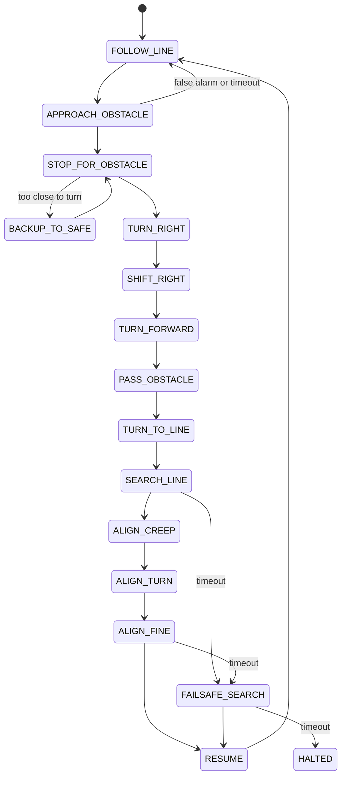

# BPUT T12 line-following and obstacle-avoidance robot

An ESP32 robot that follows a line with a PD controller on six working digital IR sensors and
passes a box obstacle on its right using a VL53L0X-compatible ToF sensor and a time-based
state machine. This repository documents the final competition sketch for the BPUT Tech Carnival
2026 T12 event and explains how to build, calibrate and tune the same class of robot for your own
chassis.

> **Read first:** the hardware description for this project differs from the uploaded sketch in a
> few places (notably IR1 is defective but still scanned by the code). They are listed in
> [`docs/CODE_VS_BRIEF_MISMATCHES.md`](docs/CODE_VS_BRIEF_MISMATCHES.md). Nothing was fixed silently.
> `src/main.ino` is the uploaded sketch with four constants changed to the reference values
> (each tagged `CHANGED (repo)`).

## Features

- PD line following on binary sensors with a weighted-average position, speed reduction on error and a soft start
- Lost-line handling: straight crossing of short gaps, edge-exit pivot, widening in-place sweep, timeout halt
- ToF obstacle detection on a core-0 task with validity filtering, consecutive-reading confirmation and staleness checks
- Safe stop distance calculated from the robot's geometry
- Time-based detour on the right side (turn, shift, turn, pass, turn, search)
- Line reacquisition, separate "line found" and "aligned" tests, automatic resume
- Failsafe sweep, timeouts at every stage, brake-and-halt behaviour
- Non-blocking 250 Hz control loop; serial commands for calibration and for testing each motion

## Hardware

| Block | Part |
|---|---|
| Controller | ESP32 Dev Module |
| Motor driver | TB6612FNG |
| Motors | 2 x BO geared DC motors, differential drive |
| Line sensors | 7 positions, **IR1 defective and unused**, 6 working (IR2..IR7) |
| Distance | VL53-series ToF, VL53L0X-compatible, I2C |
| Gyro | available, **not used** by the sketch |
| Power | 7.4 V battery, "Total 360" buck converter for the electronics |
| Chassis | custom, about 250 mm long, about 190 mm wheel span/width |

Details: [`docs/HARDWARE.md`](docs/HARDWARE.md), [`hardware/BOM.md`](hardware/BOM.md).

## Electrical architecture

```
7.4 V battery --+--> TB6612FNG VM --> BO motors
                |
                +--> "Total 360" buck --> ESP32, IR sensors, ToF
ESP32 3V3 --> TB6612FNG VCC (logic)        all grounds common
```

The buck output voltage and current, the battery capacity and the motor ratings are not given in the
project information: **USER MUST VERIFY** them. See [`hardware/POWER_ARCHITECTURE.md`](hardware/POWER_ARCHITECTURE.md).

## Pinout

| Function | GPIO | | Function | GPIO |
|---|---:|---|---|---:|
| PWMA (left speed) | 25 | | IR1 (**defective, unused**) | 14 |
| AIN1 | 26 | | IR2 | 13 |
| AIN2 | 27 | | IR3 | 16 |
| STBY | 5 | | **IR4 (centre / reference)** | **17** |
| BIN1 | 33 | | IR5 | 18 |
| BIN2 | 4 | | IR6 | 19 |
| PWMB (right speed) | 32 | | IR7 | 23 |
| SDA | 21 | | SCL | 22 |

TB6612FNG: `VCC` to 3.3 V logic, `GND` common, `AO1/AO2` left motor, `BO1/BO2` right motor.
Left motor: `AIN1`/`AIN2` set direction, `PWMA` sets speed. Right: `BIN1`/`BIN2` direction, `PWMB`
speed. `STBY` enables the driver. Full tables: [`hardware/PINOUT.md`](hardware/PINOUT.md),
[`docs/WIRING.md`](docs/WIRING.md).

## Software architecture

One sketch, `src/main.ino`. `loop()` runs on core 1; a ToF task runs on core 0 and publishes a snapshot
that `loop()` copies once per tick. Control runs every `LOOP_US = 4000 us`, so `f = 1/0.004 = 250 Hz`. The
obstacle logic is a non-blocking state machine inside `runStep()`.
See [`docs/ARCHITECTURE.md`](docs/ARCHITECTURE.md) and [`diagrams/`](diagrams/).

## Control algorithm

Each sensor gives line / no line. Weights (IR1..IR7): `-3, -2, -1, 0, +1, +2, +3`; with IR1 unused the
active weights are IR2 = -2 ... IR7 = +3, and IR4 (GPIO17) is the zero reference.

```
pos   = sum(w_i * s_i) / sum(s_i)           err = pos   (positive = line on the right)
corr  = KP*err + KD*dFilt                   KP = 32, KD = 70 (per tick), dFilt is filtered (err - lastErr)
base  = max(BASE_SPEED - SLOWDOWN*|err|, MIN_SPEED) * ramp, capped
V_left = base + corr     V_right = base - corr     each constrained to [-MAX_REVERSE, 255]
```

No integral term: nothing to cancel on a flat track, and it would wind up during line loss. Lost line:
`GAP_CROSS_MS = 180` ms of straight driving (or an edge-exit pivot), then a widening sweep for up to
`SEARCH_TIMEOUT_MS = 3500` ms, then halt. Details:
[`docs/CONTROL_ALGORITHM.md`](docs/CONTROL_ALGORITHM.md).

## Obstacle avoidance mathematics

Reference robot: `L = 250 mm`, `W = 190 mm`, ToF-to-rotation-centre 90 mm, box 100 mm, margin 20 mm.

```
R_corner   = sqrt((L/2)^2 + (W/2)^2) = sqrt(125^2 + 95^2) = 157.003 -> 158 mm
D_min_safe = 90 + 158 + 20 = 268 mm
stop 300 mm | trigger 400 mm | clear 440 mm | emergency 250 mm
D_right    = 100/2 + 190/2 + 20 = 165 mm
D_forward  = 300 + 100 + 250/2 + 20 = 545 mm
t_ms       = D_mm / V_mm_per_s * 1000      (DRIVE_MM_PER_SEC = 200)
RIGHT_SHIFT_MS = 825 ms   FORWARD_PASS_MS = 2725 ms
```

The stop value is 300 because `OBSTACLE_STOP_MM = 300` is set; the calculated floor would give 288.
`DRIVE_MM_PER_SEC` is a placeholder: **measure it**. The formula limits (sign of the sensor offset, the
absence of the offset in `D_forward`) are described in
[`docs/CODE_VS_BRIEF_MISMATCHES.md`](docs/CODE_VS_BRIEF_MISMATCHES.md) M7. Everything:
[`docs/MATHEMATICS.md`](docs/MATHEMATICS.md), [`docs/OBSTACLE_AVOIDANCE.md`](docs/OBSTACLE_AVOIDANCE.md).

### State machine



Full diagram with all halt paths: [`diagrams/state_machine.md`](diagrams/state_machine.md).

## Robot geometry

The geometry constants (`ROBOT_LENGTH_MM`, `ROBOT_WIDTH_MM`, `TOF_SENSOR_TO_ROTATION_CENTER_MM`,
`OBSTACLE_WIDTH_MM`, `SAFETY_MARGIN_MM`) feed the stop distance and the detour. They are the reference
robot's values, not universal ones. `GEOMETRY_MEASURED` stays `false` until you have measured them.

### How to recalculate the robot for your own size

1. Measure the five geometry constants and edit them.
2. Press `g` on the serial monitor to see the derived distances.
3. Measure `DRIVE_MM_PER_SEC` at `AV_DRIVE_SPEED` on your floor.
4. Calibrate `TURN_RIGHT_MS` / `TURN_LEFT_MS`.
5. Run the detour test (`o`), then the full course.

Full procedure, formulas, a 300 x 220 mm worked example and a parameter table:
[`docs/ROBOT_SIZE_ADAPTATION.md`](docs/ROBOT_SIZE_ADAPTATION.md).

## Calibration

Order: motor direction and trim, IR hardware (height, pot, order, polarity), ToF, geometry,
`DRIVE_MM_PER_SEC`, turn times, detour test. Procedure and printable checklist:
[`docs/CALIBRATION.md`](docs/CALIBRATION.md).

## Parameter tuning

Start at a low `BASE_SPEED`, tune `KP` until curves are followed but the robot starts to oscillate, add
`KD` to damp it, then raise speed in steps. Symptom table: [`docs/TUNING.md`](docs/TUNING.md).

## Build instructions

1. Assemble the chassis, mount the sensor bar rigidly across the front with IR4 on the centreline,
   mount the ToF sensor facing forward on the centreline.
2. Wire everything according to [`docs/WIRING.md`](docs/WIRING.md). Verify the buck converter's output
   voltage before connecting the ESP32; verify battery polarity.
3. Adjust the potentiometer on each IR module so it switches cleanly between line and floor.

## Upload instructions

1. Arduino IDE with the ESP32 board package (core 2.x or 3.x). Board: **ESP32 Dev Module**.
2. Library Manager: install **Adafruit VL53L0X** (it pulls in Adafruit BusIO).
3. Arduino requires a sketch to sit in a folder with the same name: open `src/main.ino` and accept the prompt to
   move it into a folder named `main`, or copy it into a folder called `main` yourself.
4. Select the port, upload, open the Serial Monitor at **115200 baud**.
5. The start-up log should show `VL53L0X OK`, then the geometry and a warning if `GEOMETRY_MEASURED` is `false`.

## Testing procedure

Never start at full speed.

1. **Power test**: voltages, polarity, no resets.
2. **Motor test**: `t`, wheels lifted.
3. **IR sensor test**: `i`, order and polarity; `c`.
4. **ToF test**: `v`, readings at known distances.
5. **Straight line test**: low `BASE_SPEED`.
6. **Curve test**: tune `KP`, `KD`, then speed.
7. **Lost line test**: gaps and an end-of-track.
8. **Obstacle detection test**: approach slowly, watch the log.
9. **Emergency stop test**: put an object inside the emergency distance.
10. **Right-side detour test**: `o` from the stop position.
11. **Line reacquisition test**: repeat `o`; watch SEARCH_LINE and ALIGN.
12. **Full-track test**: with the obstacle, at reduced speed first.

## Troubleshooting

[`docs/TROUBLESHOOTING.md`](docs/TROUBLESHOOTING.md) has a table of problems, causes, tests and fixes.

## Safety notes

- Lift the wheels for the first motor test.
- Check battery polarity and the buck output before connecting the ESP32.
- ESP32 GPIOs are not 5 V tolerant; verify the IR modules' output level.
- Use short, thick wiring for motor current; keep logic wiring away.
- The sketch has no battery monitoring and no stall detection. Stop the robot (`s` or BOOT) if it misbehaves.
- The detour assumes the right side is free: the robot does not check.

## Future improvements

Possibilities that are **not** in the current code: use the gyro for turns instead of timing, wheel encoders
for the shifts and the pass, battery-voltage compensation, an explicit IR1 mask, ToF-based verification
that the right side is free.

## Repository layout

```
src/main.ino              the sketch
docs/                     architecture, algorithm, obstacle logic, calibration, tuning, adaptation, math
hardware/                 BOM, pinout, power architecture
diagrams/                 system architecture, state machine, geometry
examples/parameter_template.h   worksheet of every constant
```

## License

MIT, see [`LICENSE`](LICENSE). The copyright holder line is a placeholder: fill it in.
